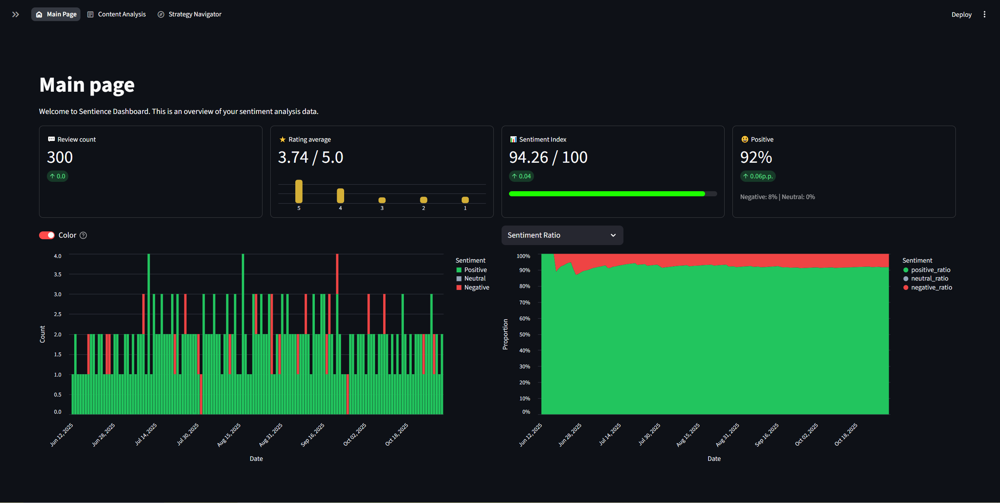

# Sentience - Sentiment Analysis Dashboard

## The Vision

With the exponential rise and popularization of AI-powered tools, they have come to be perceived either as something too advanced and unreachable, or as a neat gadget with no real use in real-world problems.

*Sentience* was created to challenge that perception.  
Its purpose is to bring practical, meaningful AI capabilities to the businesses that need them most - especially small and medium-sized companies that rarely have access to data teams, analytics departments, or expensive software.

Sentience brings clarity to customer feedback, transforming raw data into practical, actionable insights.

## Application Preview

